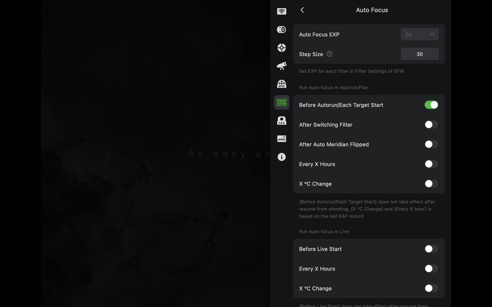
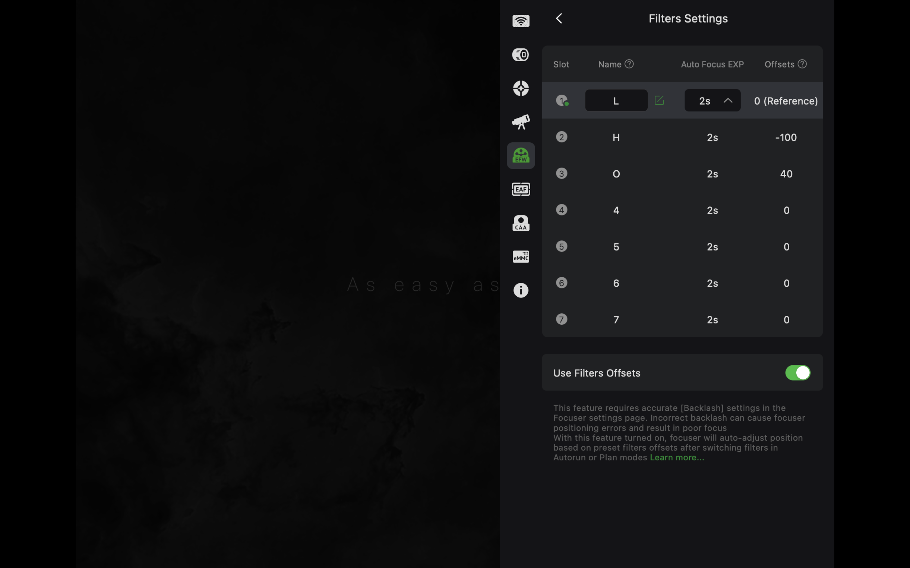
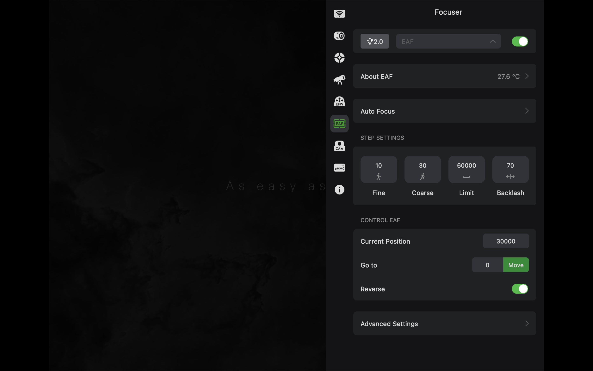
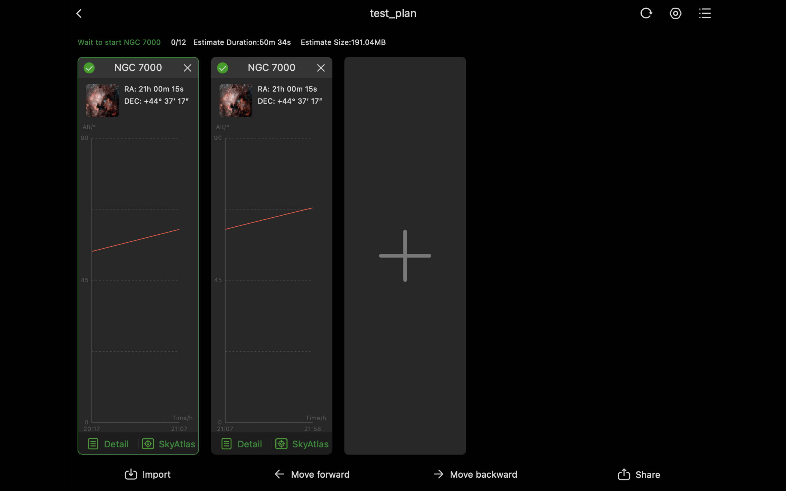
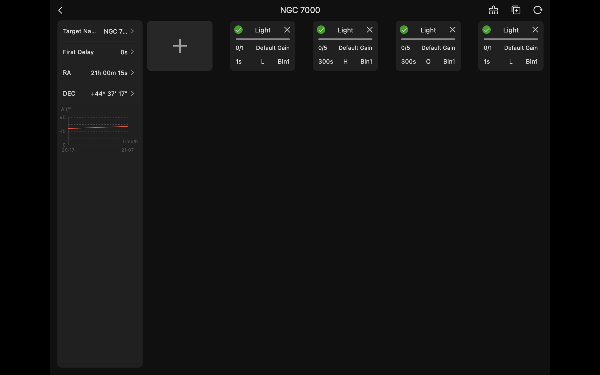

# ZWO EFW USB HID Emulator for ASIAIR

An experimental Raspberry Pi Pico / RP2040 USB HID compatibility profile that ASIAIR recognizes as a ZWO EFW. It provides three virtual filter slots for a fixed physical dualband
filter: no filter wheel or filter exchange is required.

**[Open the illustrated project page](https://kirpersidsky.github.io/rp2040-efw-hid-emulator/)**

The intended use case is fast optical systems (approximately f/4 and faster), where the converging beam can shift a narrowband filter’s effective bandpass and produce different
best-focus positions for the Ha and OIII-dominated channels. ASIAIR can autofocus once through the dual-band reference slot, then apply calibrated ZWO EAF offsets when switching
between the virtual Ha and OIII slots.

This project was built because ASIAIR's hardware integration depends on
vendor-specific USB identities and HID behaviour. A custom passive filter
selector therefore cannot normally participate in ASIAIR's filter/offset
workflow. The Pico presents the observed EFW USB identity and replays only
evidence-backed HID behaviour needed by that workflow.

It is an interoperability experiment, not an official product and not a
complete EFW implementation. Read [NOTICE.md](NOTICE.md) and
[docs/PROTOCOL_SCOPE.md](docs/PROTOCOL_SCOPE.md) first.

## What works

Validated with ASIAIR and a real ZWO EAF:

- ASIAIR recognizes the Pico as a ZWO EFW.
- ASIAIR initialization completes.
- Filter slots **1**, **2**, and **3** can be selected from ASIAIR and
  Autorun/Imaging Plan.
- ASIAIR filter names and EAF filter offsets are stored by ASIAIR and applied
  after a slot change.
- A real EAF moves by the configured offset during the tested Autorun workflow.

The emulator has no motor or physical wheel. Slot changes are intentionally
time-compressed status changes. Slots 4–7 must not be selected.

## Hardware

- Raspberry Pi Pico (RP2040)
- USB data cable
- ASIAIR host
- Optional USB-UART adapter for diagnostics
- Optional real ZWO EAF for filter-offset autofocus workflows

See [hardware/wiring.md](hardware/wiring.md) for UART wiring.

## Build

Install the Raspberry Pi Pico SDK and make its path available:

```sh
cmake -S firmware -B build -DPICO_SDK_PATH=/path/to/pico-sdk
cmake --build build
```

The expected artifact is:

```text
build/zwo_efw_emulator.uf2
```

If your environment lacks `picotool`, install a Pico SDK-compatible version
and rebuild. A temporary build with `-DPICO_NO_PICOTOOL=1` can validate the
firmware but may not generate UF2.

## Flash the Pico

1. Unplug the Pico.
2. Hold **BOOTSEL** while reconnecting it by USB.
3. Copy `build/zwo_efw_emulator.uf2` to the mounted `RPI-RP2` drive.
4. Reconnect the Pico to ASIAIR.

Optional UART logging uses GP0/TX at 115200 baud:

```sh
screen /dev/cu.usbserial-XXXX 115200
```

## ASIAIR setup

1. Connect the flashed Pico to ASIAIR and add/detect the EFW.
2. Use only ASIAIR filter slots **1–3**.
3. Rename those filters in ASIAIR if desired.
4. Configure EAF filter offsets relative to slot 1, which is the reference
   filter. For example: dual-band/reference in slot 1, Ha-focused channel in
   slot 2, OIII-focused channel in slot 3.
5. Verify each transition manually before an unattended run.

## ASIAIR configuration

Before using the emulator, measure the best EAF position for each channel and
calculate every offset relative to one reference slot. The values shown below
are examples only; use the values measured on your own optical system.

### 1. Configure when autofocus runs

In **EAF Settings > Auto Focus**, enable **Before Autorun/Each Target Start**.
Disable the other automatic-focus triggers for this workflow. Autofocus will
then run once at the beginning of each target block in Autorun or Plan mode.



*Figure 1 — Enable `Before Autorun/Each Target Start`; leave the other autofocus triggers disabled.*

### 2. Configure virtual filter slots and offsets

Open **EFW Settings > Filters Settings**. Select a reference slot and leave its
offset at `0`. Assign the measured offsets to the virtual channel slots, then
enable **Use Filters Offsets**.

In the example below, `L` is the reference slot, while `H` and `O` are virtual
slots for the H-alpha and OIII focus positions. The example values `-100` and
`+40` must not be copied blindly.



*Figure 2 — Example virtual slots and measured offsets relative to the reference slot.*

### 3. Measure and enter EAF backlash

Measure the focuser backlash and enter the result in **EAF Settings >
Backlash**. Accurate backlash compensation is important because ASIAIR may
approach offset positions from different directions. An incorrect value can
make the final focus position inconsistent.

Also verify the **Reverse** setting and the sign of every offset by switching
between the virtual slots manually and checking the resulting EAF position.



*Figure 3 — Enter the backlash measured for your own focuser; `70` is only an example.*

### 4. Split the plan into autofocus intervals

With **Before Autorun/Each Target Start** enabled, every target block becomes
one autofocus interval. Repeat the same target as several shorter blocks when
you want autofocus to run periodically during the night.

Check **Estimate Duration** at the top of the plan. This is approximately the
time between successive autofocus runs. To autofocus more often, reduce the
number of sub-exposures in each target block and add more repeated blocks.



*Figure 4 — Repeated blocks of the same target; each block starts a new autofocus interval.*

### 5. Start and finish each target block on the reference slot

The first and last exposure blocks in every target sequence should use the
reference virtual filter slot (`L` in this example). One exposure is sufficient,
and its exposure time is not important. Between them, add the required H-alpha
and OIII sub-exposures.

This pattern leaves the virtual EFW on the reference slot at the end of the
target block, ready for the next autofocus run.



*Figure 5 — Reference exposure, H-alpha block, OIII block, then one final reference exposure.*

Example sequence:

```text
Reference (L): 1 exposure
H-alpha (H):   N sub-exposures
OIII (O):      N sub-exposures
Reference (L): 1 exposure
```

### Meridian-flip planning

Because **After Auto Meridian Flipped** is disabled in this workflow, avoid
placing the meridian flip in the middle of a long target block. Adjust the block
durations so that the block containing the expected flip ends shortly before
the flip, or so that a new block—and therefore a new autofocus run—starts
immediately after it.

Treat the displayed duration as an estimate and leave some margin for slewing,
settling, dithering, downloads, and the autofocus procedure itself.

## How the protocol work was done

The project deliberately does not invent protocol commands. Each public
firmware behaviour is constrained by a combination of static analysis,
ASIAIR-to-Pico UART observations, and physical USB observations of an
EFW-S-0 firmware 3.9. Raw vendor SDKs, raw third-party USB captures, and test
logs are intentionally excluded from this repository.

See [docs/PROTOCOL_SCOPE.md](docs/PROTOCOL_SCOPE.md) for scope and limits.

## Contributing

See [CONTRIBUTING.md](CONTRIBUTING.md). In particular, do not submit vendor
SDK material or a capture you are not allowed to share.

## License

This repository's original code and documentation are released under the
[MIT License](LICENSE).
